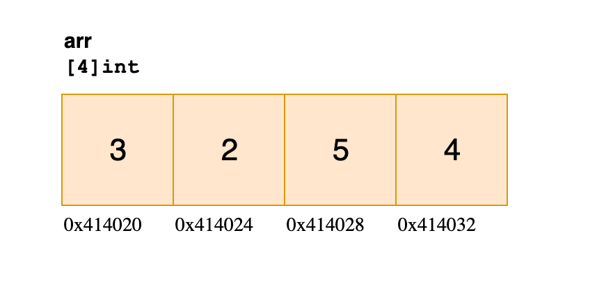
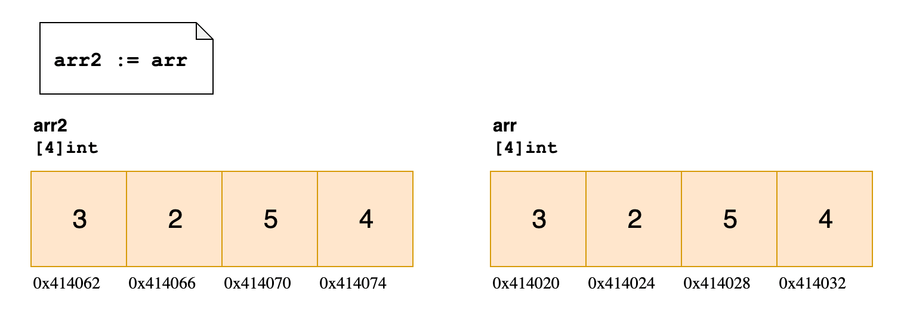
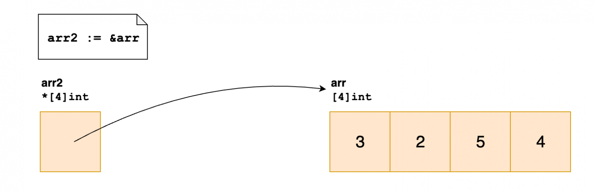

### Массивы

Массив – это коллекция фиксированного размера. Акцент здесь ставится именно на фиксированный размер, поскольку, 
как только вы зададите длину массива, позже вы уже не сможете ее изменить.

Определение массива:
```go
arr := [4]int{3, 2, 5, 4}
```

Определение массива с выводом значения длины массива
````go
arr := [...]int{1, 2, 3}
````

#### Длина и тип

В исходном коде golang тип `array` описан следующим образом:

```go
// src/go/types/array.go
type Array struct {
len  int64
elem Type
}
```

Два поля: длина - поле len (length) и тип элементов - поле elem (element).
Важно обратить внимание на то, что размер (len) включен в определение типа.

Размер массива len должна задаваться константой.

````go
a := 4
arr := [a]int{1, 2, 3} // ошибка компиляции
````

Вы не сможете приравнять друг к другу массивы разной длины и не сможете присвоить значение одного массива другому в
таком случае:

````go
arr := [4]int{3, 2, 5, 4}

longerArr := [5]int{5, 7, 1, 2, 0}

longerArr = arr
// This gives a compilation error

longerArr == arr
// This gives a compilation error
````


#### Представление в памяти

Массив хранится в виде последовательности из n блоков определенного типа. 
Они занимают фиксированный объем и имеют постоянное расположение в памяти на всё время жизни, пока за ними не придет сборщик мусора.



Эта память распределяется в момент, когда вы инициализируете переменную типа массив.

#### Примеры работы с массивом

````go
// создание
a := [3]int{1, 2, 3}

// получение элемента
fmt.Println(a[0]) // 1  
 
fmt.Println(a[4])  
// ошибка времени компиляции  
// invalid array index 4 (out of bounds for 3-element array)  

// но есть нюанс, если задавать элемент через переменную -
// всё упадёт во время выполнения
i := 4
fmt.Println(a[i])
// panic: runtime error: index out of range [4] with length 3

// изменение элемента
a[0] = 42
fmt.Printf("%#v\n", a) // [3]int{42, 2, 3}

// получение слайса
fmt.Println(a[:2])

// одной интересной особенностью является то,
// что у массива без заданных значений
// всё равно можно получить элемент по индексу
var b [3]int  
fmt.Println(b[1]) // 0  
 
// всё дело в том, что Go сам инициализирует
// все элементы значениями по умолчанию  
fmt.Printf("%#v\n", b) // [3]int{0, 0, 0}
````

#### Передача по ссылке

В Go нет такой вещи, как передача по ссылке, вместо этого все передается по значению.
Если присвоить значение массива другой переменной, то присваиваемое значение просто будет скопировано. И изменения в
исходном массиве никак не отразятся на копии.



````go
package main

import "fmt"

func main() {
	arr := [...]int{0, 1, 2, 3, 4, 5}
	b := arr
	arr[0] = 42
	fmt.Println(arr == b) // false
	// arr = [42, 1, 2, 3, 4, 5]
	// b = [0, 1, 2, 3, 4, 5]
}
````

	Если вы хотите передать лишь «ссылку» на массив, используйте указатели:



#### Передача массива в функцию

В Go массивы являются значениями, так что, когда мы передаём их функциям, те получают копию исходного массива.
Это может стать проблемой, если вы пытаетесь обновлять данные в массиве.

````go
package main

import "fmt"

func main() {  
    x := [3]int{1,2,3}

    func(arr [3]int) {
        arr[0] = 7
        fmt.Println(arr) // выводит [7 2 3]
    }(x)

    fmt.Println(x) // выводит [1 2 3] (плохо, если вам нужно было [7 2 3])
}
````

Если нужно обновить исходные данные в массиве, используйте типы указателей массива.

````go
package main

import "fmt"

func main() {  
    x := [3]int{1,2,3}

    func(arr *[3]int) {
        (*arr)[0] = 7
        fmt.Println(arr) // выводит &[7 2 3]
    }(&x)

    fmt.Println(x) // выводит [7 2 3]
}
````
#### Многомерные массивы

```go
package main

import "fmt"

func main() {
    var twoD [2][3]int
    for i := 0; i < 2; i++ {
        for j := 0; j < 3; j++ {
            twoD[i][j] = i + j
        }
     }
    fmt.Println("2d: ", twoD)
}
```

#### Источники
 - https://habr.com/ru/company/otus/blog/465613/
 - https://habr.com/ru/post/597521/