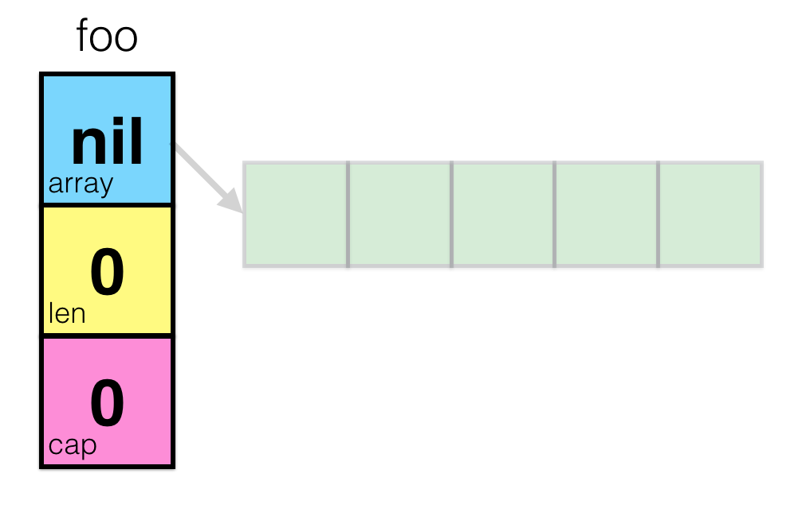
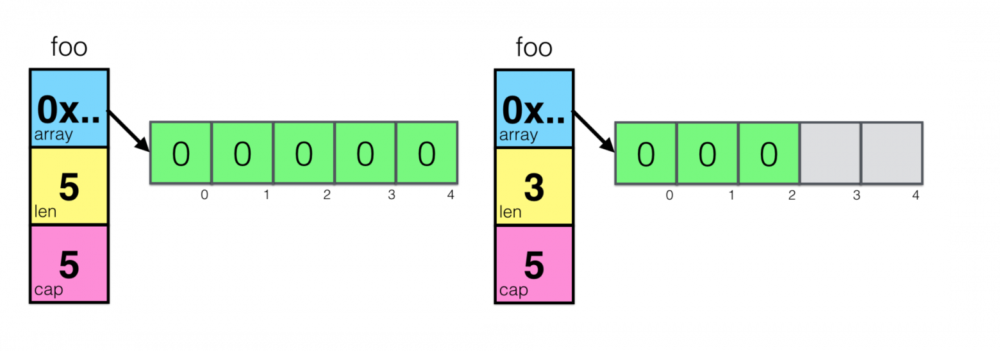
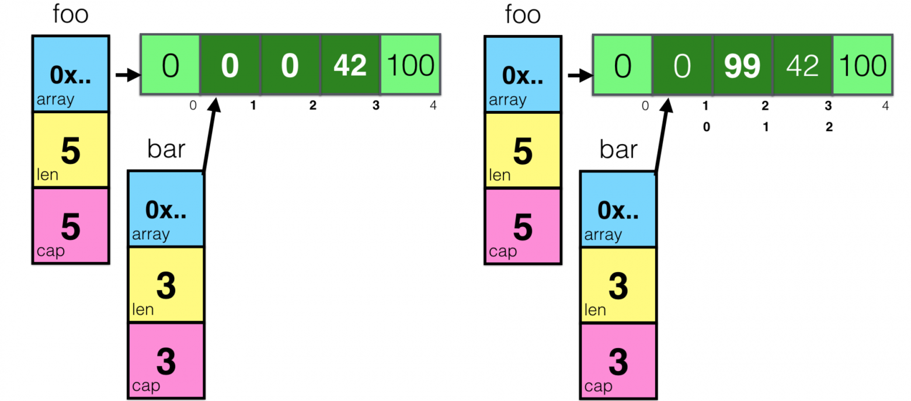

### Slice

Спецификация типа для слайсов это []T, где T - это тип элементов. В отличие от массивов, в тип слайсов длина не входит.
Cлайс объявляется как и у массивов, но без указания количества элементов:

````go
letters := []string{"a", "b", "c", "d"}
````
Слайс можно создать с помощью встроенной функции make, которая имеет такую сигнатуру:
````go
func make([]T, len, cap) []T
````
где `T` - это тип элементов создаваемого слайса. 
Функция `make` принимает следующие аргументы: тип, длину и опционально вместимость (capacity). 
Во время вызова функция make создаёт массив и возвращает слайс, который указывает на него.

````go
var s []byte
s = make([]byte, 5, 5)
// s == []byte{0, 0, 0, 0, 0} len == 5 cap == 5
````

Если не указать вместимость, по умолчанию она равна указанной длине.
````go
s := make([]byte, 5)
````
Длина и вместимость слайса могут быть получены с помощью встроенных функций: len() и cap().
Нулевое значение слайса это nil. Функции len и cap возвращают 0 для нулевого слайса.

#### slicing (получение среза)
Слайс можно также создать “слайсингом” существующего слайса или массива. 
Слайсинг осуществляется с помощью указания полуоткрытого промежутка с двумя индексами, разделёнными двоеточием. 
Например, выражение `b[i:j]`,где `0<=i<=j<=cap(b)`, создаст слайс, ссылающийся на элементы с `i` по `j-1`.
Получаемый в результате срез имеет `j-i` элементов. Если значение `i` опущено, то используется значение 0, если опущено значение `j`, 
то используется `len(b)`. Значение cap для нового слайса будет скопировано из исходного слайса.
Слайсниг не производит копирование данных слайса.
Создаётся новое значение слайса, указывающее на исходный массив.
Это делает операцию слайсинга такой же эффективной, как и манипуляции с индексами массива.

````go
b := []byte{'g', 'o', 'l', 'a', 'n', 'g'}
// b[1:4] == []byte{'o', 'l', 'a'}, располагается в том же участке памяти, где и b
````

Преобразование массива в слайс. Изменение исходного массива 

````go
package main

import "fmt"

func main() {
	x := [3]string{"Лайка", "Белка", "Стрелка"}
	s := x[:] // слайс обращается к памяти, где находится x
	s[0] = "Лисичка"
	fmt.Println(x) // [Лисичка Белка Стрелка]
}
````
#### Внутреннее устройство
Исходный код

````go
// src/runtime/slice.go

type slice struct {
    array unsafe.Pointer
    len   int
    cap   int
}
````
Слайс состоит из:
 - указатель на массив (область памяти)
 - длина (length), которая определяет количество элементов содержащихся в срезе
 - емкость (capacity), который определяет общее количество предоставленных ячеек памяти

Из этого следует, что срезы разной длины можно присваивать друг другу. 
Они имеют один и тот же тип, а указатель, длина и объем могут меняться:
````go
slice1 := []int{6, 1, 2}
slice2 := []int{9, 3}

// slices of any length can be assigned to other slice types
slice1 = slice2
````

Когда вы создаёте новый слайс, рантайм "под капотом" создаст новую переменную этого типа, с нулевым указателем (nil) и длиной и ёмкостью равными нулю. 
Это нулевое значение для слайса.


Создание слайса с заданными значениями длины и емкости:

```go
foo = make([]int, 3, 5)
```



Слайсниг не производит копирование данных слайса.
Таким образом, изменение элементов (не самого слайса) нового слайса изменяет элементы исходного:

````go
foo = make([]int, 5)
foo[3] = 42
foo[4] = 100

bar  := foo[1:4]
bar[1] = 99
````



````go
template
````

#### Передача в функцию
TODO

#### append
TODO

#### сортировка
TODO

#### Подводные камни и возможные ловушки

#### Источники
- https://habr.com/ru/post/325468/
- https://habr.com/ru/company/otus/blog/465613/
- https://habr.com/ru/post/597521/
- https://habr.com/ru/post/525940/
- https://habr.com/ru/post/660827/
- https://habr.com/ru/post/202948/
